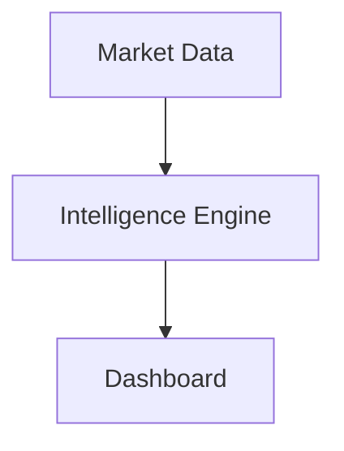

# OPENEDGE

## Project

OPENEDGE is a modular morning market research platform focused on structured observation of market conditions. The platform aggregates index behavior, sector leadership, macro catalysts, and historical matching into a single dashboard and daily research note.

OPENEDGE is designed for research workflows and does not provide financial advice.

## Features

- Morning Intelligence Dashboard
- Market Internals and OPENEDGE Morning Intelligence
- Leadership Engine with sector diagnostics
- Macro Intelligence Engine and macro risk scoring
- Historical Match Engine with similarity analysis
- Performance Dashboard metrics
- AI Research Writer
- Markdown report generation in reports/

## Research Validation

OPENEDGE includes an independent validation module in openedge/validation that evaluates research signal quality without changing any research calculations or the Intelligence Engine.

Run validation from the CLI:

```bash
python openedge.py validate
```

Validation metrics include:
- Total Signals
- Correct Signals
- Incorrect Signals
- Overall Accuracy
- Rolling 20-session Accuracy
- Rolling 50-session Accuracy (if available)
- Average Confidence
- Best Performing Regime
- Worst Performing Regime
- Average Historical Similarity

## Research Journal

Validation uses research_journal.csv for session-level tracking with append-only behavior.

Journal schema:

```text
date,market_regime,bias,confidence,actual,correct,notes
```

Helper APIs are available in openedge.validation.journal:
- append_entry()
- load_entries()
- save_entry()

## Performance Metrics

The dashboard Research Validation section provides:
- KPI cards for validation summary metrics
- Rolling Accuracy line chart
- Accuracy by Regime bar chart
- Confidence Calibration bar chart
- Monthly Accuracy bar chart

## Confidence Calibration

Calibration uses fixed confidence bands:
- 90-100
- 80-89
- 70-79
- 60-69
- Below 60

For each band OPENEDGE reports:
- Signals
- Correct
- Accuracy %

When no records are available, the dashboard shows a no-data prompt until morning workflow sessions populate the dataset and journal.

## Architecture

OPENEDGE is organized into package modules:

- Dashboard layer: Streamlit app for visualization and workflow control
- Research engine layer: score, macro, leadership, historical, intelligence, and narrative engines
- Data layer: market fetchers and CSV history storage
- Report layer: markdown report generation and export

### Intelligence Service Flow



The Sprint 8 enterprise architecture routes all market reasoning through a single deterministic `IntelligenceEngine`.
The dashboard is a presentation layer that only displays values from `engine.build_report()`, preserving a clear separation between analysis and UI.

Intelligence Engine responsibilities include:
- market regime classification
- confidence, opening risk, and opportunity scoring
- directional bias and opening style
- strengths, weaknesses, key risks, and focus generation
- system status, macro, leadership, historical, and performance report payloads

See docs/architecture.md for more details.

## Installation

1. Clone the repository.
2. Create and activate a Python virtual environment.
3. Install dependencies.

```bash
pip install -e .
```

## Quick Start

Run data collection:

```bash
python openedge.py run
```

## Running Analysis

Run analysis and generate report:

```bash
python openedge.py analyze
```

## Dashboard

Launch the dashboard:

```bash
streamlit run openedge/dashboard/app.py
```

## Project Structure

```text
openedge/
  analytics/
  dashboard/
  data/
  engines/
  models/

docs/
reports/
tests/
openedge.py
openedge_db.csv
```

## Testing

Run the full test suite:

```bash
python -m pytest -q
```

## Roadmap

See ROADMAP.md for completed and upcoming milestones.

## Contributing

See CONTRIBUTING.md for contribution workflow, branch strategy, and pull request standards.

## License

MIT License. See LICENSE.

## Disclaimer

OPENEDGE is a market research platform. It does not provide investment advice.
All outputs are for research and educational use only.

